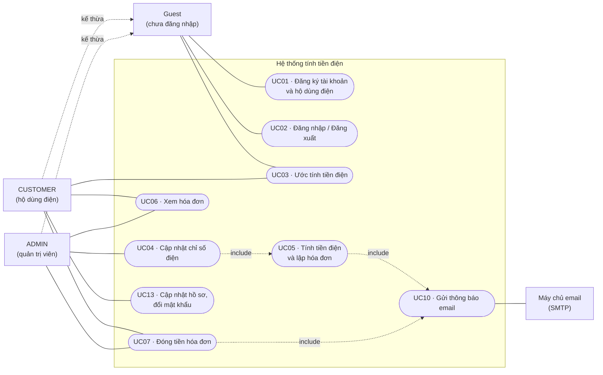
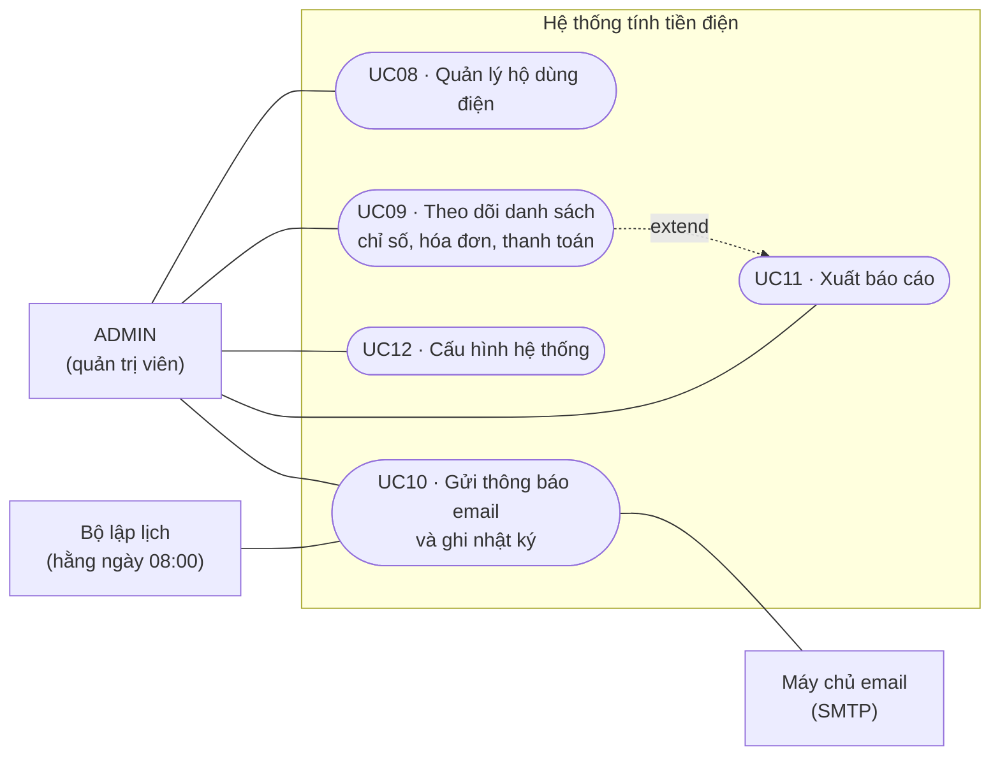

# TÀI LIỆU ĐẶC TẢ YÊU CẦU PHẦN MỀM
**(Software Requirement Specification – SRS)**

## Hệ thống tính tiền điện cho hộ cá nhân

| | |
|---|---|
| Phiên bản | 1.0.0 |
| Mã đề tài | 1 (nhóm chức năng 1.1 và 1.2) |
| Nhóm sinh viên | *<điền tên các thành viên>* |
| Ngày tạo | 01/10/2026 |
| Môn học | Đánh giá và kiểm định chất lượng phần mềm – Trường Đại học Phenikaa |

---

## Mục lục

1. Phạm vi
   1.1 Mục đích · 1.2 Nhận diện · 1.3 Kiến trúc hệ thống · 1.4 Định nghĩa và từ viết tắt
2. Các yêu cầu chức năng
   2.1 Mô tả hệ thống · 2.2 Các chức năng của hệ thống · 2.3 Đặc tả use-case · 2.4 Quy tắc nghiệp vụ và công thức tính tiền · 2.5 Mô hình dữ liệu · 2.6 Sơ đồ trang và phân quyền
3. Yêu cầu về hiệu năng và phi chức năng
   3.1 Hiệu năng · 3.2 Bảo mật · 3.3 Khả năng sử dụng · 3.4 Độ tin cậy · 3.5 Tương thích · 3.6 Khả năng bảo trì và kiểm thử

---

## 1. Phạm vi

### 1.1 Mục đích

Tài liệu này đặc tả yêu cầu cho **Hệ thống tính tiền điện cho hộ cá nhân** (sau đây gọi tắt là *Hệ thống*). Tài liệu là cơ sở để:

- cài đặt phần mềm (YC 2);
- lập kế hoạch kiểm thử, thiết kế test case, kiểm thử tự động và kiểm thử hiệu năng (YC 3 – YC 8);
- để nhóm khác review và kiểm thử chéo (YC 9).

Đối tượng đọc: nhóm phát triển, tester, giảng viên.

### 1.2 Nhận diện

| Mục | Nội dung |
|---|---|
| Tên hệ thống | Electric Billing – Hệ thống tính tiền điện cho hộ cá nhân |
| Đề tài | **1.1** Đăng ký, cập nhật số điện, tính tiền điện, đóng tiền<br>**1.2** Thông báo qua email, theo dõi danh sách, xuất báo cáo, cấu hình |
| Loại | Ứng dụng web (server-side rendering) |
| Phiên bản | 1.0.0 |

**Trong phạm vi:** hộ dùng điện sinh hoạt cá nhân, chu kỳ hóa đơn theo tháng, giá điện bậc thang, thuế VAT, thanh toán đủ một lần (thanh toán trực tuyến ở mức mô phỏng).

**Ngoài phạm vi:** kết nối cổng thanh toán thật (VNPay, MoMo…), đọc chỉ số tự động từ công tơ thông minh, nhiều hộ dùng chung một công tơ (định mức theo số hộ), điện kinh doanh/sản xuất, thanh toán một phần, phí chậm trả, công tơ quay vòng số, ứng dụng di động.

### 1.3 Kiến trúc hệ thống

**Nền tảng xây dựng**

| Thành phần | Công nghệ |
|---|---|
| Ngôn ngữ / JDK | Java 21 |
| Framework | Spring Boot 4.1.1 (Spring MVC, Spring Data JPA, Spring Security, Spring Mail, Scheduling) |
| Giao diện | Thymeleaf + Bootstrap 5 (tệp CSS đặt trong dự án, chạy được khi không có Internet) |
| CSDL | MySQL 8 (utf8mb4); H2 in-memory cho profile `h2` (chạy nhanh/kiểm thử) |
| Build | Maven (Maven Wrapper) |

**Nền tảng chạy:** máy chủ/PC cài JDK 21 và MySQL 8; người dùng truy cập bằng trình duyệt (Chrome, Firefox bản mới nhất). Cổng mặc định `8080`.

**Kiến trúc phân lớp (monolith)**

```
 Trình duyệt ──HTTP──▶ Controller (Spring MVC + Thymeleaf)
                          │
                          ▼
                       Service  ◀── BillingCalculator (tính tiền, thuần logic)
                          │            MailService ──SMTP──▶ Máy chủ email
                          ▼            ReminderScheduler (tác vụ định kỳ)
                      Repository (Spring Data JPA)
                          │
                          ▼
                       MySQL
```

**Cấu trúc gói** (`com.phenikaa.electricbilling`):

| Gói | Vai trò |
|---|---|
| `config` | Cấu hình bảo mật, khởi tạo dữ liệu mẫu |
| `domain` | Thực thể JPA và enum |
| `repository` | Truy cập dữ liệu |
| `service` | Nghiệp vụ: đăng ký, chỉ số, hóa đơn, thanh toán, thông báo, báo cáo, cấu hình |
| `scheduler` | Tác vụ định kỳ gửi nhắc nợ |
| `web` | Controller và form/DTO |

### 1.4 Định nghĩa và từ viết tắt

| Thuật ngữ | Giải thích |
|---|---|
| Hộ dùng điện / Khách hàng | Hộ cá nhân có một công tơ điện sinh hoạt, đăng ký sử dụng Hệ thống |
| Quản trị viên (ADMIN) | Nhân viên điện lực: ghi chỉ số, thu tiền, quản lý, báo cáo, cấu hình |
| Chỉ số điện | Số trên công tơ (kWh, số nguyên) |
| Kỳ | Tháng/năm của hóa đơn (ví dụ 09/2026) |
| Điện năng tiêu thụ | Chỉ số mới − chỉ số cũ (kWh) |
| Bậc thang | Biểu giá lũy tiến: mỗi khoảng kWh có đơn giá riêng |
| VAT | Thuế giá trị gia tăng, tính trên tiền điện trước thuế |
| SRS | Software Requirement Specification |
| UC / FR / BR / NFR | Use case / Yêu cầu chức năng / Quy tắc nghiệp vụ / Yêu cầu phi chức năng |

---

## 2. Các yêu cầu chức năng

### 2.1 Mô tả hệ thống

Hệ thống giúp đơn vị điện lực quản lý việc tính và thu tiền điện của các hộ cá nhân, và giúp hộ dùng điện tự theo dõi, thanh toán hóa đơn của mình.

**Tác nhân**

| Tác nhân | Mô tả |
|---|---|
| Khách (Guest) | Chưa đăng nhập: đăng ký, đăng nhập, ước tính tiền điện |
| Khách hàng (CUSTOMER) | Hộ dùng điện đã đăng nhập: xem/đóng hóa đơn, cập nhật hồ sơ |
| Quản trị viên (ADMIN) | Ghi chỉ số, thu tiền tại quầy, theo dõi danh sách, báo cáo, gửi thông báo, cấu hình |
| Máy chủ email (hệ thống ngoài) | Nhận và chuyển email thông báo qua SMTP |
| Bộ lập lịch (hệ thống) | Chạy hằng ngày lúc 08:00 để gửi email nhắc nợ |

**Quy trình nghiệp vụ tổng quát**

1. Hộ dùng điện **đăng ký** tài khoản kèm thông tin công tơ.
2. Cuối mỗi kỳ, ADMIN **ghi chỉ số điện mới** cho từng hộ.
3. Hệ thống **tự tính tiền** theo biểu giá bậc thang + VAT và **lập hóa đơn** (hạn thanh toán = ngày lập + số ngày cấu hình).
4. Hệ thống **gửi email** hóa đơn mới cho hộ.
5. Hộ **đóng tiền** online (hoặc ADMIN ghi nhận thu tiền mặt); Hệ thống gửi email xác nhận.
6. Hóa đơn chưa đóng được **nhắc** trước hạn và khi quá hạn.
7. ADMIN **theo dõi danh sách**, **xuất báo cáo**, và **cấu hình** giá/VAT/hạn/email.

**Giả định và ràng buộc**

- Chỉ số điện luôn là số nguyên không âm; không xử lý công tơ quay vòng.
- Một hộ có đúng một tài khoản đăng nhập và đúng một công tơ.
- Tiền tệ là VNĐ, làm tròn đến đồng.
- Giá trị biểu giá/VAT mặc định chỉ là dữ liệu khởi tạo, có thể sửa trong chức năng Cấu hình.

### 2.2 Các chức năng của hệ thống

**Nhóm chức năng 1.1 – Đăng ký, cập nhật số điện, tính tiền, đóng tiền**

| Mã | Chức năng | Use case | Tác nhân | Ưu tiên |
|---|---|---|---|---|
| FR01 | Đăng ký tài khoản và hộ dùng điện | UC01 | Guest | Cao |
| FR02 | Đăng nhập, đăng xuất, phân quyền | UC02 | Guest, CUSTOMER, ADMIN | Cao |
| FR03 | Ước tính tiền điện theo số kWh | UC03 | Mọi người dùng | Trung bình |
| FR04 | Ghi chỉ số điện hằng kỳ | UC04 | ADMIN | Cao |
| FR05 | Sửa chỉ số của kỳ gần nhất khi hóa đơn chưa thanh toán | UC04 | ADMIN | Trung bình |
| FR06 | Tự động tính tiền bậc thang + VAT và lập hóa đơn | UC05 | Hệ thống | Cao |
| FR07 | Xem danh sách và chi tiết hóa đơn của hộ | UC06 | CUSTOMER | Cao |
| FR08 | Đóng tiền hóa đơn trực tuyến (mô phỏng) | UC07 | CUSTOMER | Cao |
| FR09 | Ghi nhận thu tiền tại quầy | UC07 | ADMIN | Cao |
| FR10 | Cập nhật hồ sơ cá nhân, đổi mật khẩu | UC13 | CUSTOMER | Trung bình |

**Nhóm chức năng 1.2 – Thông báo email, theo dõi danh sách, xuất báo cáo, cấu hình**

| Mã | Chức năng | Use case | Tác nhân | Ưu tiên |
|---|---|---|---|---|
| FR11 | Gửi email khi có hóa đơn mới | UC10 | Hệ thống | Cao |
| FR12 | Gửi email nhắc thanh toán (sắp đến hạn, quá hạn) – tự động và thủ công | UC10 | Hệ thống, ADMIN | Cao |
| FR13 | Gửi email xác nhận thanh toán | UC10 | Hệ thống | Trung bình |
| FR14 | Nhật ký thông báo (thành công/thất bại) | UC10 | ADMIN | Trung bình |
| FR15 | Quản lý, tra cứu hộ dùng điện (xem, sửa, khóa/mở) | UC08 | ADMIN | Cao |
| FR16 | Theo dõi danh sách chỉ số, hóa đơn, thanh toán có tìm kiếm, lọc, phân trang | UC09 | ADMIN | Cao |
| FR17 | Bảng điều khiển tổng quan | UC09 | ADMIN | Thấp |
| FR18 | Báo cáo doanh thu theo kỳ, danh sách nợ, tiêu thụ theo hộ; xuất CSV | UC11 | ADMIN | Cao |
| FR19 | Cấu hình biểu giá bậc thang | UC12 | ADMIN | Cao |
| FR20 | Cấu hình VAT, hạn thanh toán, nhắc nợ, bật/tắt email | UC12 | ADMIN | Cao |

### 2.3 Đặc tả use-case

**Bảng tóm tắt use-case**

| Mã | Tên use-case | Tác nhân chính | Tác nhân phụ | Kích hoạt bởi | Chức năng |
|---|---|---|---|---|---|
| UC01 | Đăng ký tài khoản và hộ dùng điện | Guest | – | Người dùng mở `/register` | FR01 |
| UC02 | Đăng nhập / Đăng xuất | Guest, CUSTOMER, ADMIN | – | Người dùng mở `/login` | FR02 |
| UC03 | Ước tính tiền điện | Guest, CUSTOMER, ADMIN | – | Người dùng mở `/estimate` | FR03 |
| UC04 | Cập nhật chỉ số điện | ADMIN | – | Cuối mỗi kỳ ghi chỉ số | FR04, FR05 |
| UC05 | Tính tiền điện và lập hóa đơn | Hệ thống | – | UC04 (tự động) | FR06 |
| UC06 | Xem hóa đơn | CUSTOMER | ADMIN (xem chi tiết mọi hộ) | Người dùng mở danh sách hóa đơn | FR07 |
| UC07 | Đóng tiền hóa đơn | CUSTOMER (trực tuyến), ADMIN (tại quầy) | – | Hộ thanh toán / ADMIN thu tiền mặt | FR08, FR09 |
| UC08 | Quản lý hộ dùng điện | ADMIN | – | ADMIN tra cứu, sửa, khóa/mở hộ | FR15 |
| UC09 | Theo dõi danh sách | ADMIN | – | ADMIN mở bảng điều khiển / danh sách | FR16, FR17 |
| UC10 | Gửi thông báo email | Hệ thống, ADMIN | Máy chủ email (SMTP) | UC05, UC07, Bộ lập lịch 08:00, ADMIN gửi thủ công | FR11–FR14 |
| UC11 | Xuất báo cáo | ADMIN | – | ADMIN mở trang báo cáo | FR18 |
| UC12 | Cấu hình hệ thống | ADMIN | – | ADMIN mở trang cấu hình | FR19, FR20 |
| UC13 | Cập nhật hồ sơ cá nhân và đổi mật khẩu | CUSTOMER | – | Hộ mở trang hồ sơ | FR10 |

**Quan hệ giữa các use-case**

| Quan hệ | Nội dung | Diễn giải |
|---|---|---|
| «include» | UC04 → UC05 | Mỗi lần ghi chỉ số hợp lệ luôn kéo theo việc tính tiền và lập hóa đơn |
| «include» | UC05 → UC10 | Lập hóa đơn xong luôn gửi email NEW_BILL |
| «include» | UC07 → UC10 | Thanh toán thành công luôn gửi email PAYMENT_CONFIRMATION |
| «include» | UC06, UC07, UC13 → UC02 | Các chức năng này yêu cầu đã đăng nhập |
| «include» | UC04, UC08, UC09, UC11, UC12 → UC02 | Chỉ ADMIN đã đăng nhập mới dùng được |
| «extend» | UC08 → UC06 | Từ chi tiết hộ, ADMIN có thể xem thêm hóa đơn của hộ đó |
| «extend» | UC09 → UC11 | Từ danh sách, ADMIN có thể xuất thẳng dữ liệu ra CSV |
| Tổng quát hóa | CUSTOMER, ADMIN kế thừa Guest | Người đã đăng nhập vẫn dùng được UC03 (ước tính tiền điện) |

> Ghi chú: để biểu đồ dễ đọc, quan hệ «include» tới UC02 (đăng nhập) chỉ ghi trong bảng, không vẽ trên hình; điều kiện đăng nhập đã nêu ở phần tiền điều kiện của từng use-case.

**Biểu đồ use-case – nhóm chức năng 1.1 (đăng ký, chỉ số, tính tiền, đóng tiền)**



**Biểu đồ use-case – nhóm chức năng 1.2 (thông báo, theo dõi, báo cáo, cấu hình)**



Bản UML đầy đủ (ký hiệu chuẩn hình elip – người que) đặt tại `docs/usecase.puml`, mở bằng PlantUML để xuất ảnh PNG/SVG đưa vào báo cáo.

#### 2.3.1 UC01 – Đăng ký tài khoản và hộ dùng điện

| Mục | Nội dung |
|---|---|
| Tác nhân | Guest |
| Mô tả | Hộ dùng điện tạo tài khoản và khai báo thông tin hộ/công tơ |
| Tiền điều kiện | Chưa đăng nhập |
| Hậu điều kiện | Tạo tài khoản role CUSTOMER và hồ sơ hộ có mã `KHxxxxxx`, trạng thái ACTIVE |

**Luồng chính**
1. Guest mở trang `/register`.
2. Guest nhập các trường theo bảng dưới và bấm *Đăng ký*.
3. Hệ thống kiểm tra dữ liệu hợp lệ và không trùng.
4. Hệ thống lưu tài khoản (mật khẩu băm BCrypt), sinh mã hộ, chuyển sang trang đăng nhập kèm thông báo thành công.

**Luồng ngoại lệ**
- E1: Có trường không hợp lệ → hiển thị lỗi cạnh từng trường, giữ lại dữ liệu đã nhập (trừ mật khẩu).
- E2: Tên đăng nhập, email hoặc số công tơ đã tồn tại → báo lỗi tương ứng.
- E3: Mật khẩu xác nhận không khớp → báo lỗi.

**Dữ liệu và ràng buộc**

| Trường | Bắt buộc | Quy tắc |
|---|---|---|
| Tên đăng nhập | Có | 4–30 ký tự, chỉ gồm chữ, số, `_`, `.`; duy nhất |
| Mật khẩu | Có | ≥ 8 ký tự, có ít nhất 1 chữ và 1 số |
| Xác nhận mật khẩu | Có | Trùng mật khẩu |
| Họ tên | Có | 2–100 ký tự |
| Địa chỉ | Có | ≤ 255 ký tự |
| Số điện thoại | Có | 10 chữ số, bắt đầu bằng 0 |
| Email | Có | Đúng định dạng, ≤ 100 ký tự, duy nhất |
| Số công tơ | Có | 6–15 ký tự chữ/số, duy nhất |
| Chỉ số ban đầu (kWh) | Có | Số nguyên 0 – 9.999.999 |

#### 2.3.2 UC02 – Đăng nhập / Đăng xuất

| Mục | Nội dung |
|---|---|
| Tác nhân | Guest → CUSTOMER hoặc ADMIN |
| Tiền điều kiện | Tài khoản đã tồn tại và đang bật |
| Hậu điều kiện | Có phiên làm việc (hết hạn sau 30 phút không hoạt động) |

**Luồng chính:** nhập tên đăng nhập + mật khẩu tại `/login` → hệ thống xác thực → CUSTOMER chuyển tới `/customer/bills`, ADMIN chuyển tới `/admin`.

**Ngoại lệ:** sai tên/mật khẩu → báo "Tên đăng nhập hoặc mật khẩu không đúng" (không nói rõ sai trường nào); hộ bị khóa → báo "Tài khoản đã bị khóa"; truy cập trang không đủ quyền → trang 403; chưa đăng nhập mà vào trang cần quyền → chuyển về `/login`.

**Đăng xuất:** bấm *Đăng xuất* → hủy phiên, về `/login`.

#### 2.3.3 UC03 – Ước tính tiền điện

| Mục | Nội dung |
|---|---|
| Tác nhân | Mọi người dùng (không cần đăng nhập) |
| Mô tả | Nhập số kWh dự kiến, xem tiền điện chi tiết theo bậc |

**Luồng chính:** mở `/estimate` → nhập số kWh (số nguyên 0 – 99.999) → hệ thống dùng biểu giá và VAT hiện hành, hiển thị bảng từng bậc (kWh, đơn giá, thành tiền), tiền điện, VAT, tổng cộng.

**Ngoại lệ:** để trống, âm, không phải số nguyên hoặc vượt giới hạn → báo lỗi, không tính.

#### 2.3.4 UC04 – Cập nhật chỉ số điện

| Mục | Nội dung |
|---|---|
| Tác nhân | ADMIN |
| Tiền điều kiện | Đã đăng nhập ADMIN; hộ ở trạng thái ACTIVE |
| Hậu điều kiện | Lưu chỉ số của kỳ; lập hóa đơn (UC05); gửi email hóa đơn (UC10) |

**Luồng chính**
1. ADMIN mở `/admin/readings/new`, chọn hộ (tìm theo mã, tên, số công tơ).
2. Hệ thống hiển thị chỉ số cũ (chỉ số kỳ gần nhất, hoặc chỉ số ban đầu nếu chưa có kỳ nào) và gợi ý kỳ tiếp theo.
3. ADMIN nhập kỳ (tháng/năm), ngày ghi và chỉ số mới, bấm *Lưu*.
4. Hệ thống kiểm tra BR-05 → lưu chỉ số → lập hóa đơn → gửi email → hiển thị hóa đơn vừa lập.

**Luồng thay thế – sửa chỉ số (FR05):** từ chi tiết hóa đơn chưa thanh toán của kỳ gần nhất, ADMIN chọn *Sửa chỉ số*, nhập chỉ số mới; hệ thống cập nhật chỉ số và tính lại hóa đơn.

**Ngoại lệ**
- E1: Chỉ số mới < chỉ số cũ → "Chỉ số mới phải lớn hơn hoặc bằng chỉ số cũ".
- E2: Kỳ đã có chỉ số, hoặc kỳ không sau kỳ gần nhất → báo lỗi.
- E3: Ngày ghi ở tương lai hoặc không thuộc kỳ → báo lỗi.
- E4: Hộ bị khóa → không cho ghi.
- E5: Sửa chỉ số khi hóa đơn đã thanh toán (số tiền > 0) hoặc không phải kỳ gần nhất → không cho phép. Hóa đơn 0 đồng (đã tự đánh dấu PAID) vẫn được sửa; nếu sau khi sửa tổng tiền > 0 thì hóa đơn chuyển lại UNPAID.

#### 2.3.5 UC05 – Tính tiền điện và lập hóa đơn

| Mục | Nội dung |
|---|---|
| Tác nhân | Hệ thống (kích hoạt bởi UC04) |
| Mô tả | Từ điện năng tiêu thụ, tính tiền theo bậc thang + VAT, lưu hóa đơn kèm chi tiết từng bậc (ảnh chụp tại thời điểm lập) |

**Luồng chính:** lấy biểu giá và VAT hiện hành → áp dụng công thức mục 2.4 → lưu hóa đơn (số hóa đơn `HD<yyyyMM>-<mã hộ>`, kỳ, kWh, các dòng bậc, tiền điện, VAT, tổng, ngày lập, hạn thanh toán, trạng thái UNPAID).

**Ghi chú:** đổi biểu giá sau này không làm thay đổi hóa đơn đã lập. Nếu tổng tiền bằng 0 (tiêu thụ 0 kWh), hóa đơn được đánh dấu PAID ngay và không phát sinh bản ghi thanh toán.

#### 2.3.6 UC06 – Xem hóa đơn

| Mục | Nội dung |
|---|---|
| Tác nhân | CUSTOMER |
| Mô tả | Xem danh sách hóa đơn của chính mình và chi tiết từng hóa đơn |

**Luồng chính:** `/customer/bills` hiển thị hóa đơn mới nhất trước (kỳ, kWh, tổng tiền, hạn, trạng thái: *Chưa thanh toán / Quá hạn / Đã thanh toán*), có lọc theo trạng thái, phân trang → chọn một hóa đơn để xem chi tiết từng bậc và lịch sử thanh toán.

**Ngoại lệ:** truy cập hóa đơn của hộ khác → 404 (không tiết lộ sự tồn tại).

#### 2.3.7 UC07 – Đóng tiền hóa đơn

| Mục | Nội dung |
|---|---|
| Tác nhân | CUSTOMER (trực tuyến, mô phỏng), ADMIN (tại quầy) |
| Tiền điều kiện | Hóa đơn ở trạng thái UNPAID (kể cả quá hạn) |
| Hậu điều kiện | Tạo bản ghi thanh toán; hóa đơn chuyển PAID; gửi email xác nhận |

**Luồng chính – CUSTOMER:** mở chi tiết hóa đơn → chọn phương thức (Chuyển khoản / Ví điện tử) → *Thanh toán* → Hệ thống ghi nhận thanh toán đủ số tiền (mô phỏng cổng thanh toán luôn thành công), sinh mã giao dịch `PAY-...`, hiển thị biên nhận.

**Luồng chính – ADMIN:** mở chi tiết hóa đơn bất kỳ → *Ghi nhận thu tiền mặt* → hệ thống ghi nhận phương thức CASH và người thu.

**Ngoại lệ:** hóa đơn đã thanh toán (kể cả bấm hai lần/hai tab) → báo "Hóa đơn đã được thanh toán", không tạo thanh toán thứ hai; CUSTOMER chọn phương thức CASH → bị từ chối.

#### 2.3.8 UC08 – Quản lý hộ dùng điện

| Mục | Nội dung |
|---|---|
| Tác nhân | ADMIN |
| Mô tả | Tra cứu danh sách hộ, xem chi tiết (thông tin, chỉ số, hóa đơn), chỉnh sửa thông tin liên hệ, khóa/mở khóa |

**Luồng chính:** `/admin/customers` → tìm kiếm theo từ khóa (mã, họ tên, số công tơ, SĐT, email) và lọc trạng thái → chọn hộ → xem chi tiết → *Sửa* (họ tên, địa chỉ, SĐT, email; số công tơ và chỉ số ban đầu chỉ được sửa khi hộ chưa có chỉ số nào) hoặc *Khóa/Mở khóa*.

**Quy tắc:** hộ bị khóa không đăng nhập được, không ghi được chỉ số mới, vẫn thanh toán được hóa đơn cũ qua ADMIN. Không xóa hộ (chỉ khóa) để giữ lịch sử.

#### 2.3.9 UC09 – Theo dõi danh sách

| Mục | Nội dung |
|---|---|
| Tác nhân | ADMIN |
| Mô tả | Xem và tìm kiếm các danh sách phục vụ vận hành |

| Danh sách | Đường dẫn | Bộ lọc |
|---|---|---|
| Hộ dùng điện | `/admin/customers` | Từ khóa, trạng thái |
| Chỉ số điện | `/admin/readings` | Từ khóa, kỳ |
| Hóa đơn | `/admin/bills` | Từ khóa, kỳ, trạng thái (Chưa thanh toán / Quá hạn / Đã thanh toán) |
| Thanh toán | `/admin/payments` | Từ khóa, phương thức |
| Nhật ký thông báo | `/admin/notifications` | Loại, trạng thái |

Mỗi danh sách phân trang 10 dòng/trang, sắp xếp mới nhất trước. Trạng thái hóa đơn hiển thị loại trừ nhau: *Chưa thanh toán* (còn hạn), *Quá hạn*, *Đã thanh toán*. **Bảng điều khiển** `/admin` hiển thị: tổng số hộ đang hoạt động, số hóa đơn chưa thanh toán (còn hạn), số hóa đơn quá hạn, tổng tiền còn nợ (gồm cả quá hạn), doanh thu đã thu trong tháng hiện tại.

#### 2.3.10 UC10 – Gửi thông báo email

| Mục | Nội dung |
|---|---|
| Tác nhân | Hệ thống, ADMIN, máy chủ email |
| Mô tả | Gửi email cho hộ và ghi nhật ký kết quả |

| Loại | Thời điểm | Nội dung chính |
|---|---|---|
| NEW_BILL | Ngay sau khi lập hóa đơn | Kỳ, kWh, tổng tiền, hạn thanh toán |
| REMINDER | Hằng ngày 08:00, cho hóa đơn UNPAID còn đúng N ngày đến hạn (N là cấu hình, mặc định 3) | Nhắc đóng tiền |
| OVERDUE | Hằng ngày 08:00, cho hóa đơn UNPAID vừa quá hạn (1 ngày sau hạn) | Thông báo quá hạn |
| PAYMENT_CONFIRMATION | Ngay sau khi thanh toán | Số tiền, mã giao dịch |

**Luồng thủ công:** ADMIN vào `/admin/notifications` → *Gửi nhắc nợ ngay*: với mọi hóa đơn chưa thanh toán chưa từng được gửi thành công REMINDER hoặc OVERDUE, hệ thống gửi OVERDUE nếu hóa đơn đã quá hạn, ngược lại gửi REMINDER. Hoặc chọn *Gửi lại* cho từng thông báo thất bại/bỏ qua. Gửi hàng loạt chạy nền, kết quả xem trong nhật ký.

**Quy tắc**
- Mỗi cặp (hóa đơn, loại) chỉ gửi tự động một lần.
- Nếu email bị tắt trong cấu hình, hoặc SMTP lỗi, nghiệp vụ chính (lập hóa đơn, thanh toán) vẫn thành công; thông báo được ghi nhật ký trạng thái SKIPPED hoặc FAILED kèm lý do.
- Mỗi lần gửi (kể cả thất bại) tạo một dòng nhật ký: hộ, hóa đơn, loại, email nhận, tiêu đề, trạng thái, thời gian, lỗi.

#### 2.3.11 UC11 – Xuất báo cáo

| Mục | Nội dung |
|---|---|
| Tác nhân | ADMIN |
| Mô tả | Xem báo cáo trên màn hình và tải về CSV (UTF-8 có BOM để Excel đọc đúng tiếng Việt) |

| Báo cáo | Tham số | Cột |
|---|---|---|
| Doanh thu theo kỳ | Từ kỳ – đến kỳ | Kỳ, số hóa đơn, tổng kWh, tổng tiền phát hành, đã thu, còn nợ |
| Danh sách nợ | Tùy chọn: chỉ quá hạn | Mã hộ, họ tên, SĐT, email, số hóa đơn, kỳ, hạn, số tiền, số ngày quá hạn |
| Tiêu thụ theo hộ | Kỳ | Mã hộ, họ tên, số công tơ, chỉ số cũ, chỉ số mới, kWh, tiền |

**Ngoại lệ:** "Từ kỳ" sau "đến kỳ" → báo lỗi; không có dữ liệu → hiển thị "Không có dữ liệu" và CSV chỉ có dòng tiêu đề.

#### 2.3.12 UC12 – Cấu hình hệ thống

| Mục | Nội dung |
|---|---|
| Tác nhân | ADMIN |
| Mô tả | Chỉnh biểu giá bậc thang và các tham số vận hành |

**Biểu giá bậc thang** (`/admin/settings`): danh sách bậc gồm *từ kWh*, *đến kWh* (bậc cuối để trống = không giới hạn), *đơn giá (đ/kWh)*. Quy tắc lưu: bậc đầu bắt đầu từ 0; các bậc liền kề, không chồng lấn, không hở; đơn giá > 0; chỉ bậc cuối được để trống "đến". Dữ liệu sai thì không lưu và báo lỗi.

**Tham số**

| Tham số | Mặc định | Ràng buộc |
|---|---|---|
| Thuế VAT (%) | 8 | 0 – 100, tối đa 2 chữ số thập phân |
| Hạn thanh toán (ngày kể từ ngày lập) | 15 | Số nguyên 1 – 60 |
| Nhắc trước hạn (ngày) | 3 | Số nguyên 0 – 30 |
| Bật gửi email | Bật | Bật/tắt |
| Địa chỉ gửi (From) | `no-reply@electricbilling.local` | Email hợp lệ |
| Tên đơn vị điện lực | "Điện lực Phenikaa" | ≤ 100 ký tự |

Thay đổi chỉ áp dụng cho hóa đơn lập sau đó. Máy chủ SMTP/tài khoản gửi mail cấu hình trong tệp cấu hình ứng dụng (không lưu trong CSDL).

#### 2.3.13 UC13 – Cập nhật hồ sơ cá nhân và đổi mật khẩu

| Mục | Nội dung |
|---|---|
| Tác nhân | CUSTOMER |
| Mô tả | Xem hồ sơ; sửa họ tên, địa chỉ, số điện thoại, email; đổi mật khẩu |

**Đổi mật khẩu:** nhập mật khẩu hiện tại, mật khẩu mới, xác nhận. Sai mật khẩu hiện tại, mật khẩu mới không đạt quy tắc, hoặc xác nhận không khớp → báo lỗi. Quy tắc dữ liệu giống UC01. Số công tơ và mã hộ không được tự sửa.

### 2.4 Quy tắc nghiệp vụ và công thức tính tiền

| Mã | Quy tắc |
|---|---|
| BR-01 | Mã hộ `KH` + 6 chữ số tăng dần (`KH000001`…). Số hóa đơn `HD<yyyyMM>-<mã hộ>`. |
| BR-02 | Tên đăng nhập, email, số công tơ duy nhất toàn hệ thống (không phân biệt hoa thường với tên đăng nhập và email). |
| BR-03 | Điện năng tiêu thụ = chỉ số mới − chỉ số cũ. Chỉ số cũ = chỉ số mới của kỳ gần nhất, hoặc chỉ số ban đầu nếu chưa có kỳ nào. |
| BR-04 | Chỉ số mới ≥ chỉ số cũ. |
| BR-05 | Mỗi hộ tối đa một chỉ số mỗi kỳ; kỳ mới phải sau kỳ gần nhất đã ghi; ngày ghi không ở tương lai và thuộc đúng tháng của kỳ. |
| BR-06 | Tiền mỗi bậc = số kWh rơi vào bậc × đơn giá bậc, làm tròn HALF_UP đến đồng. |
| BR-07 | Tiền điện (trước thuế) = tổng tiền các bậc. |
| BR-08 | VAT = tiền điện × VAT% ÷ 100, làm tròn HALF_UP đến đồng. |
| BR-09 | Tổng cộng = tiền điện + VAT. |
| BR-10 | Hạn thanh toán = ngày lập + số ngày hạn cấu hình. |
| BR-11 | Trạng thái: UNPAID → PAID. *Quá hạn* là trạng thái suy ra: UNPAID và ngày hiện tại > hạn thanh toán. |
| BR-12 | Thanh toán phải đủ số tiền của hóa đơn, mỗi hóa đơn thanh toán đúng một lần. CASH chỉ do ADMIN ghi nhận. |
| BR-13 | CUSTOMER chỉ xem/đóng hóa đơn của chính mình; ADMIN xem tất cả. ADMIN không tạo được qua đăng ký. |
| BR-14 | Hóa đơn lưu ảnh chụp các dòng bậc và VAT% tại thời điểm lập; đổi cấu hình không ảnh hưởng hóa đơn cũ. |
| BR-15 | Hộ bị khóa không đăng nhập, không ghi chỉ số mới. |

**Công thức.** Với biểu giá gồm các bậc *i* có cận dưới *Lᵢ* và cận trên *Uᵢ* (bậc cuối *U* = ∞), điện năng *q* kWh:

```
kWh_bậc_i  = max(0, min(q, Uᵢ) − Lᵢ)
Tiền_bậc_i = round(kWh_bậc_i × Đơn_giá_i)
Tiền điện  = Σ Tiền_bậc_i
VAT        = round(Tiền điện × VAT% / 100)
Tổng       = Tiền điện + VAT
```

**Biểu giá mặc định** (điện sinh hoạt 6 bậc của EVN, áp dụng từ 10/05/2025; chỉ là dữ liệu khởi tạo – cần đối chiếu với biểu giá hiện hành và sửa trong Cấu hình nếu khác):

| Bậc | Từ (kWh) | Đến (kWh) | Đơn giá (đ/kWh) |
|---|---|---|---|
| 1 | 0 | 50 | 1.984 |
| 2 | 50 | 100 | 2.050 |
| 3 | 100 | 200 | 2.380 |
| 4 | 200 | 300 | 2.998 |
| 5 | 300 | 400 | 3.350 |
| 6 | 400 | không giới hạn | 3.460 |

**Ví dụ tính (250 kWh, VAT 8%)**

| Bậc | kWh | Đơn giá | Thành tiền |
|---|---|---|---|
| 1 | 50 | 1.984 | 99.200 |
| 2 | 50 | 2.050 | 102.500 |
| 3 | 100 | 2.380 | 238.000 |
| 4 | 50 | 2.998 | 149.900 |
| | | **Tiền điện** | **589.600** |
| | | VAT 8% | 47.168 |
| | | **Tổng cộng** | **636.768** |

### 2.5 Mô hình dữ liệu

```
app_user 1───1 customer 1───* meter_reading 1───1 bill 1───* bill_line
                  │                                  │
                  └───* notification_log *───────────┤
                                                     └───* payment
tariff_tier, system_config  (cấu hình, không khóa ngoại)
```

| Bảng | Cột chính | Ghi chú |
|---|---|---|
| `app_user` | id, username (UQ), password_hash, role (ADMIN/CUSTOMER), enabled | Tài khoản đăng nhập |
| `customer` | id, customer_code (UQ), user_id (UQ, FK), full_name, address, phone, email (UQ), meter_number (UQ), initial_reading, status (ACTIVE/LOCKED), created_at | Hộ dùng điện |
| `meter_reading` | id, customer_id (FK), period_year, period_month, previous_reading, current_reading, reading_date, recorded_by | UQ (customer_id, period_year, period_month) |
| `bill` | id, bill_no (UQ), customer_id (FK), reading_id (UQ, FK), period_year, period_month, consumption_kwh, subtotal, vat_rate, vat_amount, total_amount, issue_date, due_date, status (UNPAID/PAID) | Hóa đơn |
| `bill_line` | id, bill_id (FK), tier_no, from_kwh, to_kwh, kwh, unit_price, amount | Ảnh chụp chi tiết bậc |
| `payment` | id, bill_id (UQ, FK), amount, method (CASH/BANK_TRANSFER/E_WALLET), reference_code (UQ), paid_at, received_by | Một hóa đơn – một thanh toán |
| `notification_log` | id, customer_id (FK), bill_id (FK, null được), type, to_email, subject, status (SENT/FAILED/SKIPPED), error, created_at | Nhật ký email |
| `tariff_tier` | id, tier_no (UQ), from_kwh, to_kwh (null = không giới hạn), unit_price | Biểu giá hiện hành |
| `system_config` | config_key (PK), config_value | Tham số vận hành |

Tiền lưu kiểu `DECIMAL(15,0)`, tỷ lệ VAT `DECIMAL(5,2)`.

### 2.6 Sơ đồ trang và phân quyền

| Đường dẫn | Chức năng | Quyền |
|---|---|---|
| `/login`, `/register`, `/estimate` | Đăng nhập, đăng ký, ước tính | Công khai |
| `/customer/bills`, `/customer/bills/{id}` | Danh sách và chi tiết hóa đơn | CUSTOMER |
| `POST /customer/bills/{id}/pay` | Đóng tiền | CUSTOMER |
| `/customer/profile`, `/customer/password` | Hồ sơ, đổi mật khẩu | CUSTOMER |
| `/admin` | Bảng điều khiển | ADMIN |
| `/admin/customers`, `/admin/customers/{id}` | Quản lý hộ | ADMIN |
| `/admin/readings`, `/admin/readings/new` | Danh sách, ghi chỉ số | ADMIN |
| `/admin/bills`, `/admin/bills/{id}`, `POST /admin/bills/{id}/pay` | Hóa đơn, thu tiền mặt | ADMIN |
| `/admin/payments` | Danh sách thanh toán | ADMIN |
| `/admin/notifications` | Nhật ký, gửi nhắc nợ | ADMIN |
| `/admin/reports`, `/admin/reports/*.csv` | Báo cáo, xuất CSV | ADMIN |
| `/admin/settings` | Cấu hình | ADMIN |

Tài khoản ADMIN mặc định được tạo khi khởi động lần đầu (xem `README`); khuyến nghị đổi mật khẩu sau khi triển khai.

---

## 3. Yêu cầu về hiệu năng và phi chức năng

### 3.1 Hiệu năng

Điều kiện đo: một máy chủ ứng dụng + MySQL, cơ sở dữ liệu có 10.000 hộ và 120.000 hóa đơn.

| Mã | Yêu cầu |
|---|---|
| NFR-P1 | Với 50 người dùng đồng thời, 95% yêu cầu tải trang (đăng nhập, danh sách, chi tiết) phản hồi ≤ 2 giây |
| NFR-P2 | Ghi chỉ số + tính tiền + lập hóa đơn ≤ 1 giây (không tính thời gian gửi email) |
| NFR-P3 | Trang danh sách phân trang có tìm kiếm trên 10.000 bản ghi phản hồi ≤ 2 giây |
| NFR-P4 | Xuất CSV 10.000 dòng ≤ 10 giây |
| NFR-P5 | Hệ thống chịu được 100 người dùng đồng thời với tỷ lệ lỗi < 1% |
| NFR-P6 | Gửi email hàng loạt chạy nền, không làm chậm các thao tác khác trên giao diện |
| NFR-P7 | Gửi email lỗi/chậm (SMTP không phản hồi) không làm thao tác chính thất bại; thời gian chờ kết nối SMTP tối đa 3 giây |

### 3.2 Bảo mật

- NFR-S1: Mật khẩu lưu dạng băm BCrypt, không bao giờ hiển thị hoặc ghi log.
- NFR-S2: Phân quyền theo vai trò ở mọi đường dẫn (mục 2.6); CUSTOMER không truy cập được dữ liệu hộ khác.
- NFR-S3: Chống CSRF cho mọi form thay đổi dữ liệu; chống XSS (Thymeleaf escape đầu ra); chống SQL Injection (truy vấn tham số hóa).
- NFR-S4: Phiên hết hạn sau 30 phút không hoạt động.
- NFR-S5: Thông báo lỗi đăng nhập không tiết lộ tên đăng nhập có tồn tại hay không.

### 3.3 Khả năng sử dụng

- NFR-U1: Giao diện tiếng Việt; số tiền hiển thị dạng `636.768 đ`, ngày dạng `dd/MM/yyyy`.
- NFR-U2: Lỗi nhập liệu hiển thị cạnh trường tương ứng, nêu rõ cách sửa.
- NFR-U3: Hiển thị đúng trên màn hình từ 360 px (responsive).
- NFR-U4: Thao tác thay đổi dữ liệu có thông báo thành công/thất bại rõ ràng.

### 3.4 Độ tin cậy và toàn vẹn dữ liệu

- NFR-R1: Tính tiền dùng số thập phân chính xác (`BigDecimal`), không dùng số thực dấu phẩy động.
- NFR-R2: Lập hóa đơn và ghi chỉ số trong cùng một giao dịch; lỗi giữa chừng không để lại dữ liệu nửa vời.
- NFR-R3: Hai yêu cầu thanh toán đồng thời cho cùng một hóa đơn chỉ có một yêu cầu thành công (ràng buộc duy nhất + kiểm tra trạng thái).
- NFR-R4: Hệ thống không xóa dữ liệu lịch sử (hộ chỉ bị khóa).

### 3.5 Tương thích

- NFR-C1: Chrome và Firefox bản mới nhất; chạy trên Windows/Linux có JDK 21.
- NFR-C2: Mã hóa UTF-8 toàn hệ thống (CSDL utf8mb4, CSV có BOM).

### 3.6 Khả năng bảo trì và kiểm thử

- NFR-M1: Logic tính tiền tách khỏi tầng web/CSDL để kiểm thử đơn vị độc lập; mục tiêu độ phủ lệnh tầng `service` ≥ 80%.
- NFR-M2: Các phần tử giao diện chính có thuộc tính `id` ổn định để kiểm thử tự động bằng Selenium.
- NFR-M3: Có profile `h2` để chạy và kiểm thử mà không cần MySQL.
